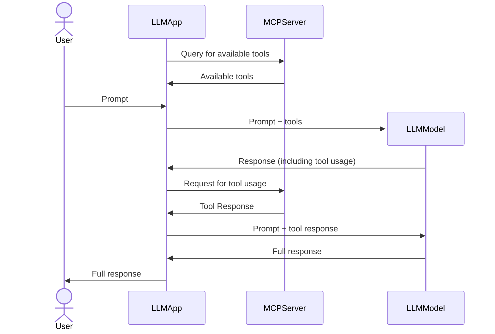

# Model Context Protocol

```mermaid
sequenceDiagram
    actor User
    participant LLMApp

    LLMApp->>MCPServer: Query for available tools
    MCPServer->>LLMApp: Available tools
    User->>LLMApp: Prompt

    create participant LLMModel
    LLMApp->>LLMModel: Prompt + tools
    LLMModel->>LLMApp: Response (including tool usage)
    LLMApp->>MCPServer: Request for tool usage
    MCPServer->>LLMApp: Tool Response

    LLMApp->>LLMModel: Prompt + tool response
    LLMModel->>LLMApp: Full response
    LLMApp->>User: Full response
```
