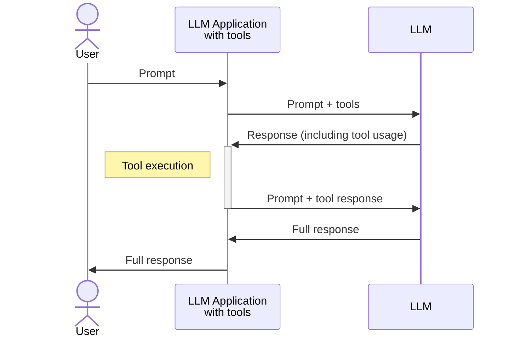
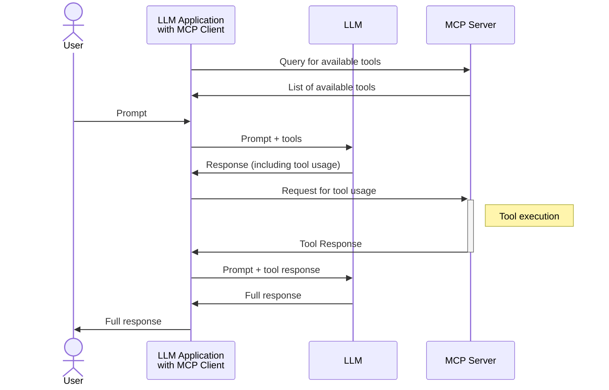

# Tools and Model Context Protocol

> Model Context Protocol is not a ground-breaking technlogy, it is a standard that puts great ideas behind a standard.

[Code explanation]

LLMs are undoubtedly powerful tools; however, by themselves, they are incapable of accessing knowledge that exists outside their training dataset.

Without external connections, LLMs essentially live in their own closed world - a world that ends at the boundary of their training data. We can also say that they are frozen in time, which makes them useless for some tasks, such as querying real-time information, interacting with other systems, and [add more tasks].

But, if you have interacted with LLMs in chat, such as ChatGPT or Claude, you are probably thinking that I am a tremendous liar – after all, these applications allow you to do things like search the internet, execute code, and connect with other systems.

Here is where tools and tool use comes in.

## Tools and LLMs

I'm not lying – LLMs by default don't have knowledge beyond what exists in their training data. However, modern LLMs have been trained to know how to use tools. These tools serve as bridges between the isolated world of the LLM and the dynamic, ever-changing external world.

I want to clarify something here: saying that an LLM knows how to use tools doesn't mean that an LLM will automatically have access to these tools or will use it on its own. The LLM needs to be instructed about which tools are available and how to interact with them.

### What are tools?

At a technical level, a tool is just code that can be executed when the LLM determines it needs to use that particular capability. The LLM generates a structured request (often in JSON format) that includes the tool name and any parameters needed.

The application or framework calling the LLM then receives this request, executes the corresponding code (as specified by the LLM), and returns the results back to the model, which can then incorporate this information into its response.

For example, a weather tool might be a simple function that takes a location parameter and returns current weather data from an external API. When the LLM decides it needs weather information to answer a user's question, it can "call" this tool, and the hosting application handles the actual API request and returns the data.

This tool-use capability is what enables modern LLM applications to break free from the constraints of their training data and interact with the world in real-time, making them much more useful for practical applications.

### Tool usage diagram

The diagram below illustrates a typical interaction between a user, an application that contains tools, and an LLM. In this standard setup, the application hosting the LLM also hosts and manages the tools.

This architecture has several important implications:

- The application acts as a mediator between the user, the LLM, and the tools
- Tool execution happens entirely within the application's environment
- The LLM never directly accesses external systems - it only requests tool usage through the application
- Security and access control are managed by the application, not the LLM itself
- This approach provides a clean separation of concerns: the LLM handles reasoning and determining when tools should be used, while the application handles the actual execution of tools and maintains control over what actions can be performed.

### Drawbacks

While tool usage is already an important advancement on its own, there are several drawbacks with this _"traditional"_ approach:

- **Tight coupling**: Applications must implement and maintain their own tool ecosystem, leading to duplicated efforts across different LLM applications

- **Limited tool availability**: Users are restricted to only the tools provided by a specific application

- **Inconsistent implementations**: Each application may implement tool interfaces differently, making it difficult for developers to create tools that work across multiple platforms

- **Scaling challenges**: Adding new tools requires modifying the application code, making rapid expansion of capabilities difficult

- **Security concerns**: Applications need to implement their own security models for each tool, potentially leading to inconsistent security practices

- **Deployment complexity**: Tools must be deployed alongside the application, complicating the deployment process

## Model Context Protocol

The Model Context Protocol (MCP) addresses these limitations by standardizing how LLM applications discover and interact with tools, regardless of where those tools are hosted.

Compared to the _"traditional"_, Model Context Protocol is not a revolutionary change in how the language model chooses to use a tool – it still interacts with these via requests to the calling application.

The change comes from **where the tools are located** and how the calling application accesses them. With MCP, tools are decoupled from the application and can be hosted on separate servers.

In practice, when a user interacts with an application that is connected to servers that support MCP, the application first queries these MCP servers to discover available tools. The application then makes these tools available to the LLM during the conversation.

When the LLM decides to use a tool, the application forwards the request to the appropriate MCP server, which executes the tool and returns the results. The application then passes these results back to the LLM, which incorporates them into its final response to the user.

The interaction can be seen in this diagram:

### Advantages

This separation of concerns allows for a more robust and flexible ecosystem where tools can evolve independently from the applications that use them, similar to how web APIs transformed software development by providing standardized interfaces for services.

In detail, the advantages are:

1. **Standardized Discovery**: MCP defines a consistent way for applications to discover available tools through a registry system. Applications can query MCP servers to find tools that meet specific criteria or capabilities.

2. **Uniform Tool Interface**: All tools in the MCP ecosystem follow the same interface patterns, making it easy for developers to create new tools that work across any MCP-compliant application.

3. **Distributed Tool Hosting**: Tools can be hosted on any MCP server, allowing for specialized providers to focus on particular domains (finance, healthcare, creative tools, etc.).

4. **Dynamic Tool Access**: Applications can access new tools at runtime without code changes, simply by connecting to different MCP servers or as new tools become available.

5. **Centralized Authentication**: MCP includes standardized authentication and authorization protocols, simplifying security management across tools.

---

## Code explanation

